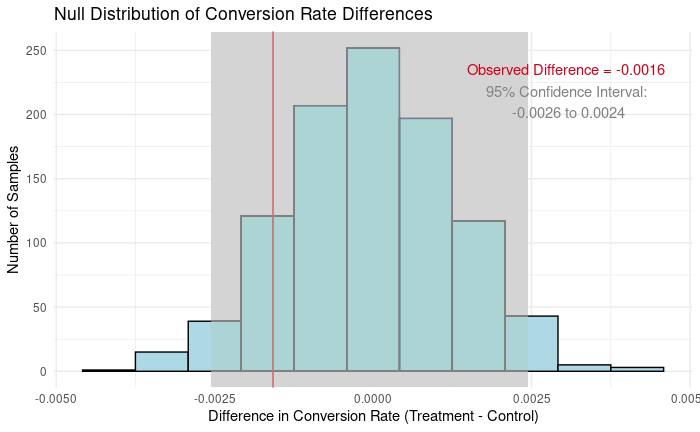

# Analyze A/B Test 

## Description

Investigates whether an e-commerce site should adopt a new landing page or keep
its old one. The A/B test results are analyzed using bootstraps to generate
p-values, which are then corroborated parametrically using a two sample z-test.

## Dependencies

### R Notebook

- R `4.3.1`
- `boot` `1.3-28.1`
- `BSDA` `1.2.2`
- `dplyr` `1.1.3` 
- `ggplot2` `3.4.3` 
- `lattice` `0.21-8`
- `readr` `2.1.4`   

## System Requirements

- **OS**: A modern operating system 
- **RAM (Memory)**: 8 GB

Please ensure that your system meets these requirements to avoid memory-related
issues during resource-intensive tasks ie bootstrapping.

## Conclusion

Both the bootstrap and parametric tests fail to demonstrate that the new page
is significantly better. Therefore, there is insufficient evidence at this time
to support adopting it. The e-commerce site should evaluate further before
deciding on a landing page.

**For a detailed analysis, please refer to the [full report](https://raw.githack.com/fyasdani/a-b-test-analysis/main/Analyze_ab_test_results_r_notebook.html).**
